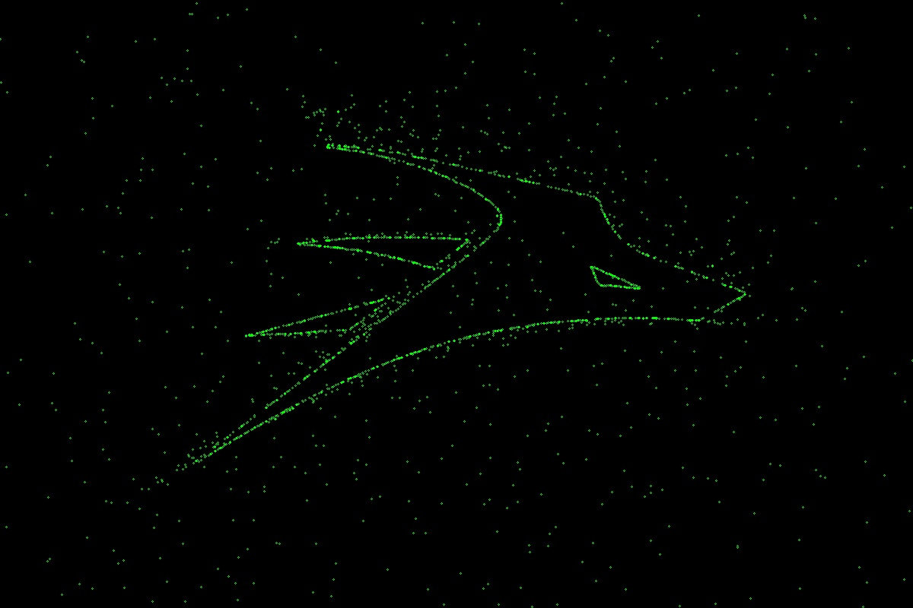

### Points

#### 思路

参考了去年培训资料上的代码来写的，大致是 世界坐标系 => 相机坐标系 => 像素坐标系，踩的几个坑（可能略低能）：

- 四元数转为矩阵 $Q$ 后（即 `Eigen::Quaterniond::matrix()` 方法），把他当作旋转矩阵来计算外参矩阵时要转置，不知道为什么（也许是 `matrix()` 方法的定义问题？）

- 平移矩阵 $T=[t_1,t_2,t_3]^T$ 不是相机的世界坐标，而是 $T=-Q^TP$ ($P$ 是相机坐标)

- 外参矩阵 $E=[R,T]=[Q^T,T]$，在此问题中尺寸为 $3\times 3$，实际计算时为了坐标对齐方便后续计算，可拓展到 $4\times 4$，即
  
  $$
  E'=
\begin{pmatrix}
R&T\\O&1
\end{pmatrix}
  $$

- 计算：
  
  $$
  Z_P\begin{pmatrix}
X_P\\Y_P\\1
\end{pmatrix}
=
I\times E'\times
\begin{pmatrix}
X_W\\Y_W\\Z_W\\1
\end{pmatrix}
  $$
  
  $X_P$ 等表示像素坐标，$X_W$ 等表示世界坐标，$I$ 是给定的 $3\times 4$ 内参矩阵

- 最后得到的归一化 $X_P$ 和 $Y_P$ 并不是全部有效的，要筛去一部分点

#### 效果

